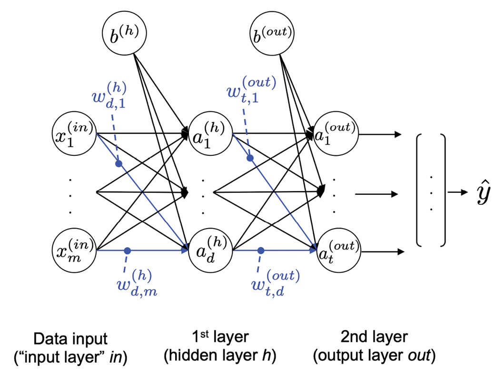
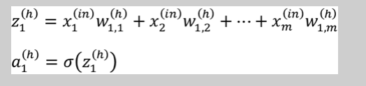
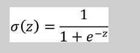
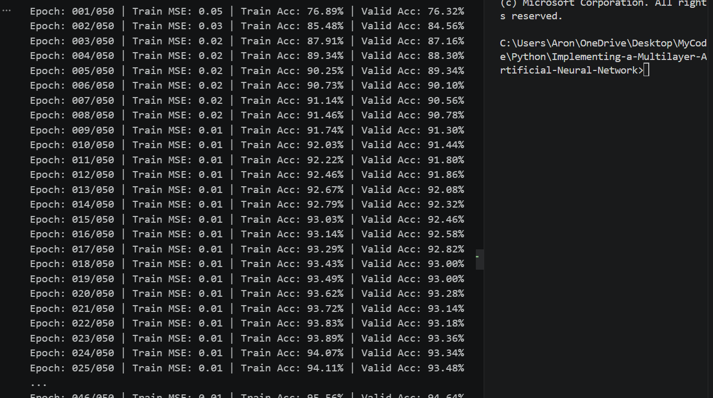
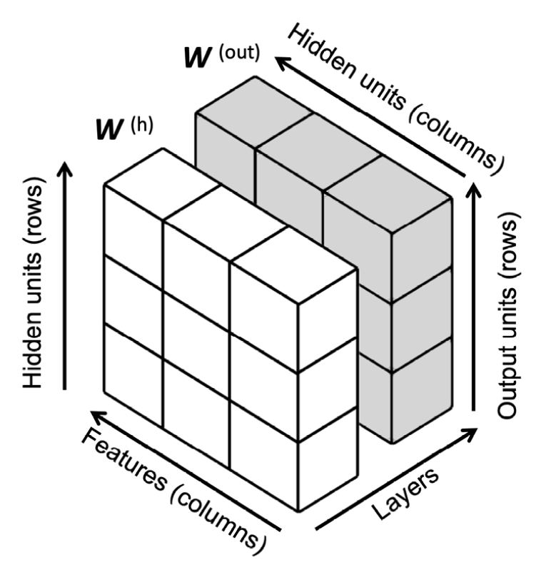
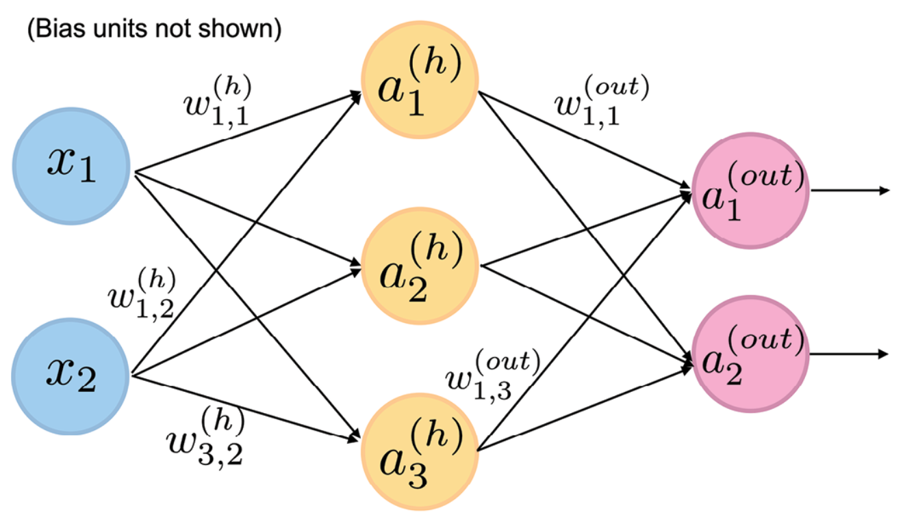
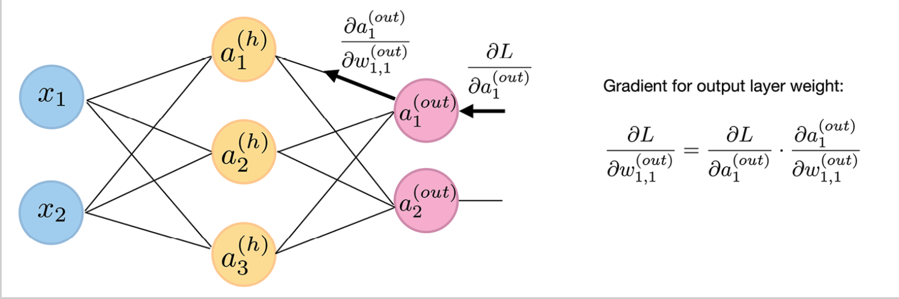

a two layer multilayer Neural netwowk 

where x is input while a is hidden input b is bias 

note:
Activating a neural network via forward propagation
  how does  MLP works:
    Starting at the input layer, we forward propagate the patterns of the training data through the network to generate an output.
    Based on the network’s output, we calculate the loss that we want to minimize using a loss function that we will describe later.
    We backpropagate the loss, find its derivative with respect to each weight and bias unit in the network, and update the model.

 we will then use forward propagation to calculate the network output and apply a threshold function to obtain the predicted class labels in the one-hot representation

 we willl then calculate the activation function of hidden layer a through: 
 and note z is the net input
 and to map the a into sigmoid we use:

 

3 dimensional tensor visualization: 

Forward-propagating the input features of an NN

Backpropagating the error of an NN
